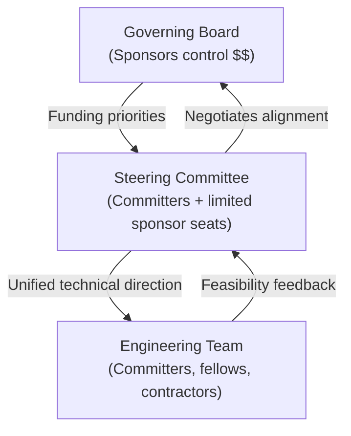

# Arctos Alliance Governance

Welcome to the governance repository for the **Arctos Alliance**.  
This repository contains documents that define how the Alliance is structured and how it operates.

## Purpose

Arctos Alliance was created to support the sustainability and independence of the Apache Arrow and Apache Parquet ecosystems.  
Our governance model ensures:
- **Sponsors** have a clear voice through financial contributions.  
- **Community committers** have authority over technical direction.  
- **Engineers** have a single, clear channel of direction.  

## Governance Structure (Diagram)

## Documents

- [Governance Charter](./arctos_governance_charter.md)  
  Defines the structure of the Governing Board, Steering Committee, and Engineering Team, along with their respective roles and responsibilities.  

- [Operating Procedures](./arctos_operating_procedures.md)  
  Defines the rules of the road: membership, good standing, meetings, voting, officers, conflicts of interest, and amendment process.  

## How to Contribute

We welcome input from sponsors, contributors, and the broader community.  
- Suggestions for updates can be made via **GitHub Issues**.  
- Proposed changes should be submitted via **Pull Requests (PRs)**.  
- Significant changes to governance documents require approval according to the voting rules defined in the Operating Procedures.  

## Transparency

The Arctos Alliance is committed to openness and accountability.  
- Annual reports will summarize finances, sponsorships, funded contributors, and technical achievements.  
- Meeting notes from Governing Board and Steering Committee meetings will be published (with sensitive HR/contract details redacted).  

## Governance Overview (Diagram)

---

**Last Updated:** Draft version – subject to community feedback.
